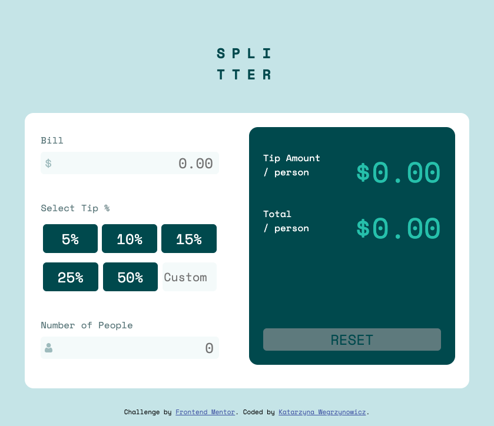

# Frontend Mentor - Tip calculator app solution

This is a solution to the [Tip calculator app challenge on Frontend Mentor](https://www.frontendmentor.io/challenges/tip-calculator-app-ugJNGbJUX). Frontend Mentor challenges help you improve your coding skills by building realistic projects.

## Table of contents

- [Overview](#overview)
  - [The challenge](#the-challenge)
  - [Screenshot](#screenshot)
  - [Links](#links)
- [My process](#my-process)
  - [Built with](#built-with)
  - [What I learned](#what-i-learned)
  - [Continued development](#continued-development)
- [Author](#author)

## Overview

### The challenge

Users should be able to:

- View the optimal layout for the app depending on their device's screen size
- See hover states for all interactive elements on the page
- Calculate the correct tip and total cost of the bill per person

### Screenshot

### Links

- Solution URL: 
- Live Site URL: 

## My process
I decided to code this project with pure Javascript to further cement my understanding of Javascript fundamentals. I also used mobile first responsive design, flexbox, CSS, and HTML5.

Step 1: I chunked the mobile layout to determine how to code the HTML keeping in mind best practices for accessibility.

Step 2: Coded HTML.

Step 3: Coded CSS styles starting from top to bottom, making adjustments to HTML as needed. (ie. To make icons in form input fields persist, I included a span surrounding the input field in which the icon lives).

Step 4: With CSS styles in approximately the right places, I coded the Javascript functionality. 

Step 5: With Javascript functionality in place, I went back to the CSS to  finalize matching the design prototype as closely as possible.

### Built with

- Semantic HTML5 markup
- CSS custom properties
- Flexbox
- Mobile-first workflow
- Javascript
- Adobe Photoshop

### What I learned

This project was a great opportunity to practice refactoring pure Javascript for cleaner, less repetitive code. For example, I originally wrote the validationInput function with if statements for each of 3 user input elements (bill amount, number of people, custom tip amount). Then, I refactored validationInput to take in two arguments (element and elError) instead, eliminating the need for 3 separate if statements. Instead of 30+ lines of code, the function was reduced to 9 lines of code.

### Continued development

I am currently more confident writing code in vanilla JS as opposed to using a JS framework like React. To become more adept at writing code in React, I plan to recreate this project in that framework for learning purposes.

## Author

- Website - [Katarzyna Wegrzynowicz](https://katarzyna-kw.github.io/portfolio-website/)
- Frontend Mentor - [@katarzyna-kw](https://www.frontendmentor.io/profile/katarzyna-kw)
- Github - [@katarzyna-kw](https://github.com/katarzyna-kw)